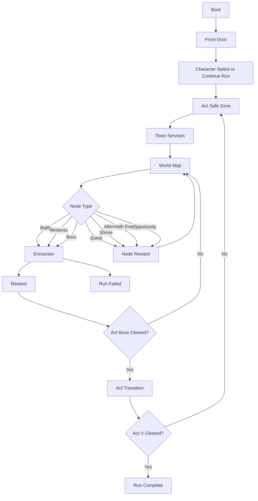

# Application Architecture

Last updated: March 8, 2026.

Documentation note:
- Start with `PROJECT_MASTER.md`.
- Use `CODEBASE_RULES.md` for live module ownership and architecture patterns.
- Use `IMPLEMENTATION_PROGRESS.md` for the live milestone snapshot.
- Use this document as the engineering bridge between the current runtime and the next product-manager-approved build targets.
- Treat `COMBAT_FOUNDATION.md` as current combat truth and `GAME_ENGINE_FLOW_PLAN.md` as broader product-direction guidance.

## Purpose

This document answers one question:

- how do we grow the current party-combat prototype into the full Blood Rogue run loop without losing the working architecture.

It defines:

- the top-level game loop
- the live runtime state model
- the current domain boundaries
- the next extraction and build seams
- the implementation order that should drive team work

## Current Runtime Truth

The live workspace already has four active implementation layers.

### 1. Browser delivery layer

- `index.html` defines script order and boot wiring.
- the browser loads emitted runtime files from `generated/src/**`.

### 2. TypeScript source modules under `src/`

- `src/content/game-content.ts` owns authored cards, hero defaults, mercenaries, and fallback content
- `src/content/seed-loader.ts` loads the live seed bundle
- `src/content/content-validator-world-paths.ts` owns authored-path state collectors, reference-state assembly, and opportunity-variant matching helpers for validation-heavy world content
- `src/content/content-validator-world-opportunities.ts` owns late-route opportunity-family validation plus shared reward, grant, and string-id helpers for world-node validation
- `src/content/content-validator-runtime-content.ts` owns runtime-content validation for starter decks, class progression, mercenary route perks, generated encounter coverage, and consequence encounter packages
- `src/content/content-validator.ts` remains the public validator entry, error-reporting surface, and the home for the remaining early world-node validation
- `src/content/encounter-registry-enemy-builders.ts` owns role grouping, elite-affix lookups, and generated enemy template or intent builders for encounter content
- `src/content/encounter-registry-builders.ts` owns act encounter-set assembly on top of the private enemy-builder seam
- `src/content/encounter-registry.ts` remains the public registry entry that derives act encounter, boss, elite-affix, and archetype-behavior catalogs from seed data
- `src/character/class-registry.ts` adapts class seeds into hero shells and starter decks
- `src/quests/world-node-catalog-opportunities.ts` owns the late-route opportunity-family catalog literals, shared choice builders, and extra authored opportunity variants for the quest domain
- `src/quests/world-node-outcomes.ts` owns quest, shrine, event, and opportunity outcome recording for authored world-node rewards
- `src/quests/world-node-catalog.ts` owns the base quest-domain catalog literals, catalog assembly, and world-node catalog validation on top of `src/quests/world-node-catalog-opportunities.ts`
- `src/quests/world-node-zones.ts` owns world-node choice shaping, act-specific definition lookup, and zone-construction helpers for the quest domain
- `src/quests/world-node-variants.ts` owns event follow-up and authored opportunity-variant resolution for the quest domain
- `src/quests/world-node-engine.ts` owns quest, shrine, aftermath-event, and opportunity node families plus the public reward-flow resolution surface on top of `src/quests/world-node-catalog-opportunities.ts`, `src/quests/world-node-catalog.ts`, `src/quests/world-node-outcomes.ts`, `src/quests/world-node-zones.ts`, and `src/quests/world-node-variants.ts`
- `src/run/run-state.ts` owns run defaults plus shared value-normalization helpers for the run domain
- `src/run/run-route-builder.ts` owns act-route generation, world-node normalization, and current-act zone lookup helpers for the run domain
- `src/run/run-progression.ts` owns level growth, class-tree progression, and derived run bonuses
- `src/run/run-reward-flow.ts` owns encounter reward assembly, reward application, and act-completion transitions
- `src/run/run-factory.ts` owns run creation plus the public orchestration surface for the run domain
- `src/combat/combat-modifiers.ts` owns encounter-modifier retuning, opening-script shifts, and modifier-side log messaging for combat encounters
- `src/combat/combat-engine.ts` owns deterministic encounter resolution and routes encounter-modifier application through `src/combat/combat-modifiers.ts`
- `src/items/item-data.ts` owns authored item, rune, runeword, and rune-reward templates
- `src/items/item-catalog.ts` owns runtime item, rune, and runeword catalog helpers plus equipment normalization
- `src/items/item-loadout.ts` owns loadout, inventory, stash, sockets, and derived-combat-bonus helpers
- `src/items/item-town.ts` owns vendor stock, pricing, direct vendor-to-stash consignment, planning-aware vendor routing, and town-facing item-economy helpers
- `src/items/item-system.ts` owns reward-facing item curation and the public item-domain orchestration surface
- `src/town/service-registry.ts` owns healer, belt, vendor, mercenary, and progression town actions
- `src/state/*.ts` owns run or profile persistence and migrations
- `src/app/app-engine.ts` owns top-level phase transitions and app-level orchestration
- `src/app/main.ts` is a thin DOM and event bridge into phase-owned `src/ui/*` modules
- `src/ui/ui-common.ts` owns shared account-summary fallbacks, planning-summary helpers, and continuity markup that phase views can reuse without reading raw profile state

### 3. Seed and authored data

- `data/seeds/d2/*.json` currently supply classes, zones, enemy pools, monsters, bosses, items, runes, and runewords
- `skills.json` now feeds class-progression normalization, tree metadata, and runtime spend summaries
- `assets-manifest.json` exists in the repo but is not yet wired into the live runtime
- `src/types/game.d.ts` owns shared runtime contracts across app, run, combat, content, items, persistence, and tests

### 4. Verification and packaging

- `tests/*.test.ts` compile into `generated/tests/*.test.js` and load the browser runtime in a VM harness
- `tests/helpers/browser-harness.ts` owns the shared compiled-browser harness used by the split app-engine and combat suites and centralizes the runtime manifest arrays for validator, encounter, item, run, persistence, and UI helper chains
- `index.html` and `tests/helpers/browser-harness.ts` now load the combat helpers in the order `combat-modifiers` -> `combat-engine`
- `index.html` and `tests/helpers/browser-harness.ts` now load the validator helpers in the order `content-validator-world-paths` -> `content-validator-world-opportunities` -> `content-validator-runtime-content` -> `content-validator`
- `index.html` and `tests/helpers/browser-harness.ts` now load the quest helpers in the order `world-node-catalog-opportunities` -> `world-node-catalog` -> `world-node-outcomes` -> `world-node-zones` -> `world-node-variants` -> `world-node-engine`
- `scripts/build.js` copies `index.html`, emitted runtime files, assets, and seed data into `dist/`

## What The Live Runtime Already Owns

- boot-time seed loading
- seed and generated-content validation
- front door, character select, safe zone, world map, encounter, reward, act transition, and run-end phases
- front-door saved-run review plus continue or explicit abandon flow, profile summary, and onboarding surfaces
- phase-owned UI modules under `src/ui/*` with `src/app/main.ts` kept thin
- class-derived hero setup and mercenary selection
- five-act route generation and generated encounter pools
- act-specific boss scripting, multi-affix elite packages, and act-tuned archetype behavior
- quest, shrine, aftermath-event, and opportunity nodes routed through the existing reward flow, including the late-route covenant, detour, and escalation follow-through families
- safe-zone recovery, belt refill, mercenary hire or replace or revive, vendor refresh or buy or sell or consign to stash, inventory or stash actions, and town-hub presentation panels
- deterministic combat plus choice-based reward carry-through
- milestone-aware reward payouts and boss progression pivots driven by account feature gates, training-grounds or war-college or paragon-doctrine or apex-doctrine or legend-doctrine or mythic-doctrine unlocks, archive-backed `war_annals` or `legendary_annals` or `immortal_annals` mastery pressure, mastery focus, and profile-aware late-act equipment replacement curation
- `skills.json`-backed class progression, favored-tree summaries, manual stat allocation, and derived combat-bonus handoff
- expanded item, rune, runeword, and vendor-economy curation with a higher late-game loot band, stronger replacement pressure, milestone-aware vendor stock or rune routing or pricing rules across carried and stash-planned bases plus salvage-tithe or artisan-stock or brokerage-charter or treasury-exchange and economy-focus pressure, sovereign-tier market leverage through `merchant_principate`, `sovereign_exchange`, and `ascendant_exchange`, third-wave market leverage through `trade_hegemony`, `imperial_exchange`, and `mythic_exchange`, direct vendor-to-stash consignment, profile-owned runeword planning charters, archive-backed charter-ledger pressure for unfulfilled plans, stash-ready charter staging summaries for compatible or prepared or ready bases, archive-backed repeat-forge pricing or rune-routing pressure once a charter is already proven, cross-charter planning-overview summaries for missing-base or socket or rune pressure, content-aware planning-id sanitization across hydrate or town routing or reward pivots, cross-tree convergence pressure through `chronicle_exchange`, `sovereign_exchange`, `legendary_annals`, `ascendant_exchange`, `imperial_exchange`, `immortal_annals`, and `mythic_exchange`, and profile-aware reward-side replacement pivots
- run snapshots, profile-backed stash persistence, richer archived run-history summaries, account unlock milestones, mutable preferred-class or tutorial or settings APIs, focused account-tree controls, prerequisite-aware account-tree capstones, profile-owned runeword planning targets, archived charter-target fulfillment data, cross-tree convergence bundles, and account-facing stash or archive or capstone-review summaries plus stash-ready planning-charter staging summaries and cross-charter planning-overview summaries that now feed live archive retention, town economy, or reward gates, including heroic-annals or mythic-annals or eternal-annals or sovereign-annals or imperial-annals retention, merchant-principate or trade-hegemony economy depth, legend-doctrine or mythic-doctrine mastery pivots, archive-backed repeat-forge charter summaries with best-clear detail, and live planning-charter sanitization during profile hydrate and migration
- front-door, safe-zone, world-map, reward, act-transition, and run-end shell panels that surface the live account unlock, tutorial, and profile-summary seams plus focused-tree review or control surfaces, with direct front-door preferred-class or settings or tutorial or planning controls, charter-ledger review, stash-ready charter staging review, cross-tree convergence review, interactive archive review over richer archived runs, and a shared account-meta continuity board built from stable account summaries

## What The Live Runtime Still Does Not Own

- broader meta or profile UX beyond the current unlock buckets, archive or economy or mastery trees plus the present heroic-annals or mythic-annals or eternal-annals or sovereign-annals or imperial-annals, artisan-stock or brokerage-charter or treasury-exchange or merchant-principate or trade-hegemony, and war-college or paragon-doctrine or apex-doctrine or legend-doctrine or mythic-doctrine pass, current convergence layer, current account-hall controls including runeword planning, charter-ledger review, convergence review, the current archive-review surfaces, and the current shared continuity board
- broader mercenary pool and richer mercenary scaling rules
- broader authored node catalogs beyond the current quest, shrine, aftermath-event, and opportunity set, including anything materially beyond the current covenant-plus-detour-plus-escalation late-route fabric
- broader authored item breadth, feature-gated reward variety, and final late-run loot tuning beyond the current higher-tier catalog, current treasury-exchange consignment sink, current trade-hegemony or imperial-exchange or mythic-exchange market layer, current runeword-planning charters, and current charter-ledger pressure

## Product Loop

The live and target loop should stay structurally aligned:

## Phase Contract

The runtime now uses one explicit top-level phase enum:

- `boot`
- `front_door`
- `character_select`
- `safe_zone`
- `world_map`
- `encounter`
- `reward`
- `act_transition`
- `run_complete`
- `run_failed`

Reserved future addition:

- `meta_sync`

Rules:

- only the app shell changes top-level phase
- combat turn flow is not a top-level app phase
- vendor, stash, and progression spend flows are subviews inside `safe_zone`
- tooltips and confirmation panels never become top-level phases

## Live State Model

The current runtime effectively stabilizes around five state buckets.

### `AppState`

Owns shell-level control:

- current top-level phase
- loaded registries and content
- selected class and mercenary UI state
- current profile
- active run
- active combat state
- shell error state

### `ProfileState`

Owns account-level persisted state that already exists:

- active run snapshot
- stash entries
- run history
- settings
- preferred class
- unlock and tutorial ownership
- account-tree focus and milestone summaries

Future extraction target:

- a broader `MetaState` can eventually absorb unlocks, settings, tutorials, and legacy progression if that surface grows enough to justify separation

### `RunState`

Owns one run across acts:

- selected class
- selected mercenary contract
- current act, zone, and node
- route graph and reachable nodes
- deck and card upgrades carried between fights
- equipped items
- carried inventory and stash transfer boundaries
- rune and socket state
- potion belt and refill state
- quest, shrine, and event outcomes
- follow-up consequence flags
- gold, XP, level, training ranks, and skill points
- reward queue
- town service state including vendor stock

### `CombatState`

Owns one encounter only:

- combatants
- combat resources
- intent schedule
- temporary statuses
- temporary buffs and debuffs
- draw, hand, and discard state
- encounter outcome

### `UIState`

Owns interaction state only:

- selected class and mercenary
- pending abandon confirmation
- selected target
- open panel
- hovered card, item, or node
- recent message or notification state

## Domain Boundaries

The application should keep these domain boundaries intact.

### 1. App Shell

Responsibility:

- boot the game
- load registries
- load or create profile
- load or create or continue run
- enforce top-level phase transitions
- hand the correct state slice to the correct screen

Current files:

- `src/app/app-engine.ts`
- `src/app/main.ts`

Future extraction targets:

- `src/app/phase-controller.ts`
- `src/app/navigation-state.ts`

### 2. Content Registry

Responsibility:

- load normalized content from seed and authored sources
- validate IDs and references
- expose immutable registries for classes, items, runes, runewords, enemies, mercenaries, zones, bosses, cards, and world nodes

Current files:

- `src/content/game-content.ts`
- `src/content/seed-loader.ts`
- `src/content/content-validator-world-paths.ts`
- `src/content/content-validator-world-opportunities.ts`
- `src/content/content-validator-runtime-content.ts`
- `src/content/encounter-registry-enemy-builders.ts`
- `src/content/encounter-registry-builders.ts`
- `src/content/encounter-registry.ts`
- `src/content/content-validator.ts`

Live seams:

- `src/content/content-validator-world-paths.ts` centralizes authored-path state collection, act reference-state assembly, and opportunity-variant matching helpers that used to live inline in `src/content/content-validator.ts`
- `src/content/content-validator-world-opportunities.ts` centralizes late-route opportunity-family validation plus shared reward, grant, and string-id helpers that used to live inline in `src/content/content-validator.ts`
- `src/content/content-validator-runtime-content.ts` centralizes starter-deck, class-progression, mercenary route-perk, generated-encounter, and consequence-package validation that used to live inline in `src/content/content-validator.ts`
- `src/content/encounter-registry-enemy-builders.ts` centralizes act enemy-pool normalization, role grouping, elite-affix lookups, and enemy template or intent builders that used to live inline in `src/content/encounter-registry.ts`
- `src/content/encounter-registry-builders.ts` centralizes act encounter-set assembly while keeping `src/content/encounter-registry.ts` as the public browser entry
- `src/content/content-validator.ts` remains the public validator entry and error-reporting surface for the content domain, and it no longer needs a `max-lines` suppression after the late-route opportunity split

Next extraction targets:

- follow-on validator passes should build from `src/content/content-validator-world-paths.ts`, `src/content/content-validator-world-opportunities.ts`, and `src/content/content-validator-runtime-content.ts` instead of re-expanding `src/content/content-validator.ts`
- any eventual quest-domain authored-content split should build from `src/quests/world-node-catalog-opportunities.ts`, `src/quests/world-node-catalog.ts`, `src/quests/world-node-zones.ts`, and `src/quests/world-node-variants.ts` instead of re-expanding `src/quests/world-node-engine.ts`

Next expansion:

- add broader normalization support for content families beyond the current `skills.json`, item, rune, and runeword adapters
- wire future asset-manifest support into the live runtime

### 3. Character and Progression Domain

Responsibility:

- class baselines
- level-based training growth
- class-tree progression
- manual stat allocation
- favored-tree summaries
- derived combat values
- class starter decks

Current files:

- `src/character/class-registry.ts`
- `src/run/run-progression.ts`
- `src/run/run-factory.ts`

Future extraction targets:

- `src/character/stat-system.ts`
- `src/character/skill-tree-system.ts`
- `src/character/deck-builder.ts`

### 4. Run Domain

Responsibility:

- create a run
- generate act routes
- advance nodes
- hand off into encounter, quest, shrine, event, and reward resolution
- decide act transitions and run completion

Current files:

- `src/run/run-state.ts`
- `src/run/run-route-builder.ts`
- `src/run/run-progression.ts`
- `src/run/run-reward-flow.ts`
- `src/run/run-factory.ts`

Live seams:

- `src/run/run-state.ts` centralizes run defaults plus reusable numeric or bonus helpers
- `src/run/run-route-builder.ts` centralizes act-route generation and world-node normalization
- `src/run/run-progression.ts` centralizes class progression, training growth, and derived combat bonuses
- `src/run/run-reward-flow.ts` centralizes reward assembly, reward application, and act completion logic
- `src/run/run-factory.ts` remains the single public entry point for run mutation and cross-domain callers

Operating rule:

- keep `src/run/run-factory.ts` as the thin public orchestration surface
- keep route, progression, and reward logic in the existing run helpers instead of drifting back into `src/run/run-factory.ts`

### 5. Combat Domain

Responsibility:

- pure deterministic combat resolution
- card play
- status resolution
- enemy AI
- mercenary AI
- encounter win or loss result

Current bridge:

- `src/combat/combat-engine.ts`

Future split:

- `src/combat/combat-state.ts`
- `src/combat/card-resolution.ts`
- `src/combat/enemy-ai.ts`
- `src/combat/mercenary-ai.ts`
- `src/combat/status-system.ts`

### 6. Rewards and Economy Domain

Responsibility:

- reward offers after fights and nodes
- gold payouts
- potion payouts
- item and rune offers
- card rewards
- progression spend hooks
- vendor stock generation and pricing

Current files:

- `src/rewards/reward-engine.ts`
- `src/items/item-town.ts`
- `src/items/item-system.ts`
- `src/town/service-registry.ts`

Future extraction targets:

- `src/rewards/card-reward-system.ts`
- `src/rewards/drop-tables.ts`
- `src/economy/vendor-system.ts`
- `src/economy/gold-ledger.ts`

### 7. Itemization Domain

Responsibility:

- inventory
- stash handoff
- equipment slots
- runes
- sockets
- runewords
- combat bonuses derived from loadout

Current files:

- `src/items/item-data.ts`
- `src/items/item-catalog.ts`
- `src/items/item-loadout.ts`
- `src/items/item-town.ts`
- `src/items/item-system.ts`

Future extraction targets:

- keep `src/items/item-loadout.ts` and `src/items/item-town.ts` small enough that `src/items/item-system.ts` stays an orchestration surface
- only split deeper item helpers if one of those private modules grows back into a hotspot

### 8. Town and Services Domain

Responsibility:

- safe-zone service availability
- healing
- vendor flows
- stash transfer
- progression spend actions
- mercenary hire or replace or revive

Current file:

- `src/town/service-registry.ts`

Future extraction targets:

- `src/town/town-state.ts`
- `src/town/mercenary-hall.ts`
- `src/town/vendor-inventory.ts`

### 9. Quest and Event Domain

Responsibility:

- quest generation
- quest follow-up consequences
- shrine effects
- aftermath-event outcomes
- opportunity-chain outcomes
- future special-event families

Current file:

- `src/quests/world-node-catalog-opportunities.ts`
- `src/quests/world-node-catalog.ts`
- `src/quests/world-node-outcomes.ts`
- `src/quests/world-node-zones.ts`
- `src/quests/world-node-variants.ts`
- `src/quests/world-node-engine.ts`

Future extraction targets:

- further act- or opportunity-family catalog shards under `src/quests/*`
- `src/events/event-system.ts`

### 10. Persistence Domain

Responsibility:

- save or load profile and run snapshots
- versioning and migrations
- run history records
- crash-safe resume

Current files:

- `src/state/persistence.ts`
- `src/state/save-migrations.ts`
- `src/state/profile-migrations.ts`

### 11. UI Domain

Responsibility:

- front door
- character select
- safe zone
- world map
- combat HUD
- reward panels
- act transition
- run summary

Current files:

- `src/app/main.ts`
- `src/ui/ui-common.ts`
- `src/ui/front-door-view.ts`
- `src/ui/character-select-view.ts`
- `src/ui/safe-zone-view.ts`
- `src/ui/world-map-view.ts`
- `src/ui/combat-view.ts`
- `src/ui/reward-view.ts`
- `src/ui/act-transition-view.ts`
- `src/ui/run-summary-view.ts`

## Data Ownership Rules

These rules keep the loop coherent.

1. Content data is read-only at runtime.
- do not mutate registries

2. `RunState` owns permanent-in-run changes.
- gained gold
- deck changes
- inventory and loadout changes
- quest, shrine, and event outcomes
- progression and vendor state

3. `CombatState` owns temporary encounter changes.
- damage
- temporary Guard
- Burn
- target marks
- next-attack buffs

4. Combat rewards are applied only after encounter resolution.
- fights and nodes resolve through app or run reward seams, not direct permanent mutation from UI code

5. Internal helper seams do not change public ownership.
- `run-state`, `run-route-builder`, `run-progression`, and `run-reward-flow` can be called by `run-factory`
- `item-data`, `item-catalog`, `item-loadout`, and `item-town` can be called inside the item domain while other domains still enter through `item-system`
- other domains still use `run-factory` instead of reaching into those helpers directly

6. Mercenary definition and mercenary combat instance are separate.
- catalog data lives in content
- hired mercenary state lives in `RunState`
- combat copy lives in `CombatState`

## Screen Ownership

The live prototype already ships thin versions of these screens. The next build should deepen them without collapsing their boundaries.

1. `Front Door`
- start run
- continue run
- abandon run
- saved-run summary
- run-history and stash summary

2. `Character Select`
- class pick
- class preview
- starter deck preview
- mercenary preview

3. `Safe Zone`
- healing
- vendor
- inventory and stash
- mercenary hire or replace or revive
- progression spend actions
- leave town

4. `World Map`
- act and zone labels
- reachable nodes
- node prerequisites
- quest, shrine, aftermath, and opportunity visibility
- boss route visibility

5. `Encounter`
- combat HUD
- target selection
- card play
- potion belt
- mercenary status
- visible enemy intents

6. `Reward`
- post-fight and post-node rewards
- card, item, rune, or boon choices
- quest, shrine, event, and opportunity outcome summaries

7. `Run End`
- win or loss summary
- build recap
- run-history handoff

## Full Game Loop Build Order

Implement in this order. Current status is noted so the live workspace and plan stay aligned.

### Milestone 1: Content and Bootstrap (`implemented`)

Live:

- seed loader
- class registry
- encounter registry
- content validation
- build packaging

Still missing:

- skill-tree and asset-manifest content wired into the runtime
- broader normalization

### Milestone 2: App Shell and Run Lifecycle (`implemented`)

Live:

- front door
- continue or abandon run
- profile hall and onboarding guidance
- character select
- app engine
- run creation
- safe-zone handoff
- profile-backed snapshot bootstrap

Still missing:

- broader profile settings or unlock surfaces beyond the current shell

### Milestone 3: World Map Loop (`implemented`)

Live:

- act route generator
- node traversal
- battle, miniboss, boss, quest, shrine, aftermath, and opportunity nodes
- return-to-map after encounter or node
- act transitions through Act V

Still missing:

- richer routing and broader authored node catalogs

### Milestone 4: Rewards and Progression (`implemented`)

Live:

- reward screens
- gold, XP, and potion payouts
- card additions and upgrades
- party boons
- item and rune reward choices
- training-rank spends in town
- `skills.json`-backed class trees, manual stat allocation, and favored-tree summaries
- stronger boss progression pivots and derived combat-bonus handoff

Still missing:

- deeper reward tiers and more authored late-act reward curation

### Milestone 5: Safe Zone and Mercenary Management (`partial`)

Live:

- town services
- mercenary hire or replace or revive
- vendor stock refresh and buy or sell flows
- stash and inventory actions

Still missing:

- broader service differentiation
- broader mercenary roster and scaling

### Milestone 6: Itemization (`implemented`)

Live:

- item and rune rewards
- equipment and inventory
- stash transfer
- sockets
- expanded runewords
- broader item and rune catalogs
- higher late-game loot band, socket-ready late vendor stock, and stronger replacement pressure

Still missing:

- broader authored loot breadth
- final late-run loot tuning

### Milestone 7: Quests, Shrines, and Events (`partial`)

Live:

- quest, shrine, aftermath-event, and opportunity nodes
- consequence flags and multi-step chain state
- node reward resolution through the existing phase machine

Still missing:

- broader authored route-side catalogs

### Milestone 8: Run Completion and Meta (`implemented`)

Live:

- act transitions through Act V
- run summary
- run history
- active-run and stash persistence
- account unlock buckets
- tutorial-state ownership
- profile summary APIs, focused-tree shell controls, and migration coverage

Still missing:

- broader profile and account UX
- future unlock trees beyond the current buckets

## Guardrails

Do not:

- reintroduce lane movement as a core combat system
- make forecast UI solve turns for the player
- let town logic leak into the combat resolver
- let combat directly mutate profile or meta state
- hardcode item, rune, or mercenary behavior in UI files

Do:

- keep combat deterministic
- keep content data-driven
- keep encounter state separate from run state
- keep top-level app phases explicit
- keep growing the game by adding domains, not by expanding `src/app/main.ts`

## Immediate Next Execution Targets

The next implementation work should follow the product-manager-owned lanes:

1. Agent 1
- deepen front-door and town UX around the current profile, vendor, stash, progression, and node systems

2. Agent 2
- continue late-run loot tuning beyond the current higher-tier economy band and the current `trade_hegemony` or `imperial_exchange` or `mythic_exchange` market layer, broaden authored progression or economy content, and grow future meta loops beyond the current milestone-driven unlock, tutorial, settings, account-summary, and third-wave account-tree seams

3. Agent 3
- broaden node families, deepen quest chains, expand elite or archetype variety, and harden the content pipeline for those new authored surfaces
