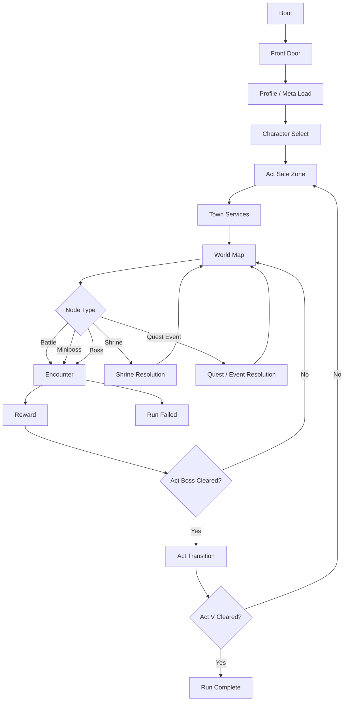

# Application Architecture

Last updated: March 7, 2026.

Documentation note:
- Start with `PROJECT_MASTER.md`.
- Use this document for the application structure needed to build the full game loop from the current combat foundation.
- Treat `COMBAT_FOUNDATION.md` as current runtime truth and `GAME_ENGINE_FLOW_PLAN.md` as product-direction truth.

## Purpose

This document answers one question:

- how do we grow the current hero-plus-mercenary combat prototype into the full Diablo II-inspired roguelite loop without rebuilding the repo blindly.

It defines:

- the top-level game loop
- the runtime state model
- the system boundaries
- the file/module ownership plan
- the recommended implementation order

## Current Starting Point

The live app currently has three active runtime surfaces:

1. `content.js`
- static content catalogs for hero, mercenaries, cards, enemies, and sample encounters

2. `combat-engine.js`
- deterministic encounter resolver for:
  - hero turn
  - mercenary action
  - enemy intents
  - potions
  - victory / defeat

3. `main.js`
- browser shell for encounter selection, target selection, card play, potions, restart, and render

This is enough to serve as the combat core for the real game.

It is not enough to own:

- run generation
- class selection
- town flow
- rewards
- items and runes
- quests and shrines
- persistence
- meta progression

## Product Loop

The target application loop should be:

## Phase Contract

Use one top-level phase enum for the full app:

- `boot`
- `front_door`
- `meta_sync`
- `character_select`
- `safe_zone`
- `world_map`
- `encounter`
- `reward`
- `act_transition`
- `run_complete`
- `run_failed`

Rules:

- Only the app shell changes top-level phase.
- Combat turn flow is not a top-level app phase.
- Town dialogs, vendor panels, and hire flows are subviews inside `safe_zone`.
- Reward screens are subviews inside `reward`.
- Tooltips and confirmation modals never become phases.

## Encounter Contract

The encounter layer should stay deterministic and self-contained.

Encounter owns:

- hero combat stats for the current fight
- mercenary combat stats for the current fight
- enemy pack state
- hand, draw, discard, and exhaust zones
- turn order
- card resolution
- potion usage inside combat
- status effects
- combat log
- victory / defeat result

Encounter does not own:

- act routing
- gold economy
- reward choice persistence
- town services
- quest ledger
- permanent inventory
- meta unlocks

Those belong to `RunState` or `MetaState`.

## State Model

The application should stabilize around five state buckets.

### `AppState`

Owns shell-level control:

- current top-level phase
- loaded registries
- current view/subview
- active profile ID
- active run ID
- dirty/save-needed flags

### `MetaState`

Owns account-level progress:

- unlocked classes
- long-run legacy upgrades
- seen tutorials
- run history
- settings
- unlock flags for vendors, mercenary pools, and future systems

### `RunState`

Owns one run across acts:

- selected class
- selected mercenary contract
- current act, zone, and node
- route graph and reachable nodes
- deck, draw rules, and card upgrades carried between fights
- equipped items
- rune inventory and socket state
- potion belt and refill state
- quests
- shrine resolutions
- gold, XP, level, stats, and skill points
- reward queue
- town service availability

### `CombatState`

Owns one encounter only:

- combatants
- combat resources
- intent schedule
- temporary statuses
- temporary buffs and debuffs
- combat-only summons and temporary cards
- encounter outcome

### `UIState`

Owns interaction state only:

- selected target
- hovered card / item / node
- open panel
- pending confirm action
- focused reward option
- recent message / notification state

## Domain Boundaries

The application should be split into these domains.

### 1. App Shell

Responsibility:

- boot the game
- load registries
- load or create profile
- load or create run
- enforce top-level phase transitions
- hand the correct state slice to the correct screen

Recommended files:

- `src/app/app-shell.js`
- `src/app/phase-controller.js`
- `src/app/navigation-state.js`

### 2. Content Registry

Responsibility:

- load normalized content from:
  - `data/seeds/d2/*.json`
  - authored JS or JSON combat content
- validate IDs and references
- expose immutable registries for classes, skills, items, runes, runewords, enemies, mercenaries, zones, bosses, and cards

Recommended files:

- `src/content/content-registry.js`
- `src/content/seed-loader.js`
- `src/content/content-validator.js`
- `src/content/content-normalizers.js`

### 3. Character Domain

Responsibility:

- class baselines
- stat growth
- skill tree allocation
- derived combat values
- class starter decks and skill bars

Recommended files:

- `src/character/class-registry.js`
- `src/character/stat-system.js`
- `src/character/skill-tree-system.js`
- `src/character/deck-builder.js`

### 4. Run Domain

Responsibility:

- create a run
- generate act routes
- advance nodes
- hand off into encounter, shrine, event, and reward resolution
- decide act transitions and run completion

Recommended files:

- `src/run/run-state.js`
- `src/run/run-factory.js`
- `src/run/world-map-generator.js`
- `src/run/node-resolver.js`
- `src/run/act-transition.js`

### 5. Combat Domain

Responsibility:

- pure deterministic combat resolution
- card play
- status resolution
- enemy AI
- mercenary AI
- encounter win/loss result

Current bridge:

- `combat-engine.js`

Recommended future split:

- `src/combat/combat-state.js`
- `src/combat/combat-engine.js`
- `src/combat/card-resolution.js`
- `src/combat/enemy-ai.js`
- `src/combat/mercenary-ai.js`
- `src/combat/status-system.js`

### 6. Reward and Economy Domain

Responsibility:

- reward offers after fights
- gold payouts
- potion drops
- item drops
- card rewards
- card-family upgrades
- shrine payouts
- vendor stock generation

Recommended files:

- `src/rewards/reward-engine.js`
- `src/rewards/card-reward-system.js`
- `src/rewards/drop-tables.js`
- `src/economy/vendor-system.js`
- `src/economy/gold-ledger.js`

### 7. Itemization Domain

Responsibility:

- inventory
- equipment slots
- affixes
- runes
- sockets
- runewords
- item effects that modify combat and deck behavior

Recommended files:

- `src/items/item-system.js`
- `src/items/equipment-system.js`
- `src/items/rune-system.js`
- `src/items/runeword-system.js`

### 8. Town and Services Domain

Responsibility:

- safe-zone layout and service availability
- healing
- vendors
- stash-equivalent decisions if added later
- mercenary hire / replace / revive
- quest/NPC interactions

Recommended files:

- `src/town/town-state.js`
- `src/town/service-registry.js`
- `src/town/mercenary-hall.js`
- `src/town/vendor-inventory.js`

### 9. Quest and Event Domain

Responsibility:

- quest generation
- quest progress updates
- shrine effects
- special event outcomes
- boss quest milestones

Recommended files:

- `src/quests/quest-system.js`
- `src/quests/shrine-system.js`
- `src/events/event-system.js`

### 10. Persistence Domain

Responsibility:

- save/load profile and run snapshots
- versioning and migrations
- run history records
- crash-safe resume

Recommended files:

- `src/state/persistence.js`
- `src/state/save-migrations.js`
- `src/state/run-history.js`

### 11. UI Domain

Responsibility:

- front door
- character select
- safe zone
- world map
- combat HUD
- reward panels
- run summary

Recommended files:

- `src/ui/front-door-view.js`
- `src/ui/character-select-view.js`
- `src/ui/safe-zone-view.js`
- `src/ui/world-map-view.js`
- `src/ui/combat-view.js`
- `src/ui/reward-view.js`
- `src/ui/run-summary-view.js`

## Data Ownership Rules

These rules keep the full loop coherent.

1. Content data is read-only at runtime.
- Do not mutate registries.

2. `RunState` owns permanent-in-run changes.
- gained gold
- deck changes
- equipped items
- quest progress
- shrine outcomes

3. `CombatState` owns temporary encounter changes.
- damage
- temporary Guard
- Burn
- target marks
- next-attack buffs

4. Combat rewards are applied only after encounter resolution.
- a fight cannot directly mutate run inventory without going through reward resolution.

5. Mercenary definition and mercenary combat instance are separate.
- catalog data lives in content
- hired mercenary state lives in `RunState`
- combat copy lives in `CombatState`

## Screen Ownership

The first complete playable application should have these screens:

1. `Front Door`
- start run
- continue run
- run history
- legacy/meta entry

2. `Character Select`
- class pick
- class preview
- starter deck and skill preview
- mercenary preview if unlocked early

3. `Safe Zone`
- healing
- vendor
- mercenary hire/replace/revive
- quest/NPC context
- leave town

4. `World Map`
- act and zone labels
- reachable nodes
- quest markers
- boss route visibility

5. `Encounter`
- current combat HUD
- target selection
- card play
- potion belt
- mercenary status
- visible enemy intents

6. `Reward`
- post-fight card/item/gold/potion choices
- level-up/stat allocation when triggered
- quest payout if completed

7. `Run End`
- win or loss summary
- build recap
- progression earned
- restart or return to menu

## Current-To-Target File Strategy

Do not rewrite the whole repo at once.

Use this extraction path:

### Step 1

Keep current root runtime files working:

- `content.js`
- `combat-engine.js`
- `main.js`

### Step 2

Introduce `src/` modules for new domains first:

- app shell
- content registry
- run state
- rewards
- persistence

### Step 3

Move current combat logic behind the same public API:

- `createCombatState`
- `playCard`
- `endTurn`
- `usePotion`

This lets the UI keep working while combat internals move under `src/combat`.

### Step 4

Replace the current encounter sandbox UI with phase-aware screens one by one:

- front door
- character select
- safe zone
- world map
- encounter
- reward

### Step 5

Retire root-level compatibility files only after the `src/` path is active and tested.

## Full Game Loop Build Order

Implement in this order.

### Milestone 1: Content and Bootstrap

Ship:

- seed loader
- content validation
- class registry
- enemy and boss registry
- item/rune registry

Exit:

- boot can load all required content and fail clearly on broken IDs

### Milestone 2: App Shell and Run Lifecycle

Ship:

- front door
- character select
- phase controller
- new run creation
- save/load scaffold

Exit:

- player can start, resume, and abandon a run cleanly

### Milestone 3: World Map Loop

Ship:

- act route generator
- node traversal
- battle/miniboss/boss node types
- return-to-map after encounter

Exit:

- player can complete one act through map traversal and combat

### Milestone 4: Rewards and Progression

Ship:

- reward screens
- card additions
- card-family upgrades
- XP, level, stat points, and skill points

Exit:

- the run changes meaningfully after each encounter

### Milestone 5: Safe Zone and Mercenary Management

Ship:

- town services
- mercenary hire/replace/revive
- vendor stock
- potion refill rules

Exit:

- acts feel structurally different from encounters

### Milestone 6: Itemization

Ship:

- item drops
- equipment
- sockets
- runes
- runewords

Exit:

- loot becomes a first-class build driver

### Milestone 7: Quests, Shrines, and Events

Ship:

- quest ledger
- shrine nodes
- special events
- quest rewards

Exit:

- pathing decisions matter beyond raw combat EV

### Milestone 8: Run Completion and Meta

Ship:

- act transitions through Act V
- run summary
- run history
- legacy/meta progression

Exit:

- full start-to-finish run loop exists

## Guardrails

Do not:

- reintroduce lane movement as a core combat system
- make forecast UI solve turns for the player
- let town logic leak into combat resolver
- let combat directly mutate account/meta state
- hardcode item, rune, or mercenary behavior in UI files

Do:

- keep combat deterministic
- keep content data-driven
- keep encounter state separate from run state
- keep top-level app phases explicit
- build the game loop by adding domains, not by expanding `main.js`

## Immediate Next Execution Targets

The next implementation work should produce these concrete artifacts:

1. `src/content/seed-loader.js`
- loads and validates D2 seed JSON

2. `src/app/phase-controller.js`
- owns top-level phase transitions

3. `src/run/run-factory.js`
- creates the first real `RunState`

4. `src/ui/front-door-view.js`
- replaces direct encounter sandbox boot

5. `src/ui/character-select-view.js`
- starts the run from class choice instead of fixed hero content

These are the minimum pieces needed to stop thinking in terms of isolated combat tests and start building the full game loop.
