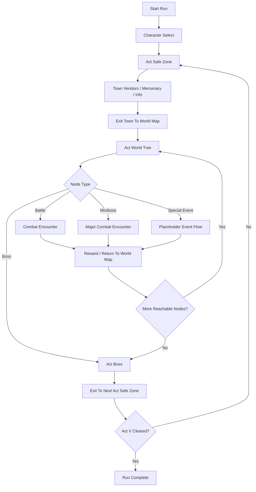

# Game Engine and Flow Plan (High-Fidelity D2 Run Structure)

Documentation note:
- Start with `PROJECT_MASTER.md`.
- This document describes the target gameplay/run-flow architecture, not the exact current runtime implementation.

## 1) Product Targets
- Build target: turn-based roguelite deckbuilder with high-fidelity Diablo II structure.
- Content spine: Acts I-V, canonical towns, canonical zones, canonical enemies/bosses, class skill trees, and recognizable quest beats.
- Core readability rule: every state answers `who am I`, `what can I do`, and `what happens next`.
- Fidelity rule: preserve canonical D2 structure and names where feasible; compress only for run readability and production scope.

## 2) Engine Architecture

### 2.1 Data-Driven Content Layer
- Source of truth files:
  - `data/seeds/d2/classes.json`
  - `data/seeds/d2/skills.json`
  - `data/seeds/d2/zones.json`
  - `data/seeds/d2/enemy-pools.json`
  - `data/seeds/d2/assets-manifest.json`
- Runtime should normalize these into immutable registries keyed by ID.
- New content should be add-only in JSON first, logic second.

### 2.2 Runtime State Model
- `MetaState`: unlocked classes, global upgrades, profile settings.
- `RunState`: class, stats, deck, gear, current act/zone/node, run economy.
- `CombatState`: turn order, intents, statuses, cooldowns, timeline log.
- `UIState`: selected target, open panel, hovered tooltips, pending confirmations.

### 2.3 Core Systems
- `ProgressionSystem`: builds act/zone route, tracks stage completion.
- `EncounterSystem`: resolves world-tree nodes such as `battle`, `miniboss`, `boss`, and later `special_event`.
- `CombatSystem`: deterministic turn resolver (player phase -> enemy phase -> end-turn effects).
- `RewardSystem`: battle rewards, miniboss rewards, post-boss rewards, level-up points, and town-economy handoff.
- `CharacterSystem`: class baseline + level stats + gear + tree bonuses.
- `SkillTreeSystem`: validates prerequisites, spend points, grants passive/active unlocks.
- `PersistenceSystem`: save/load snapshots with schema versioning.

### 2.4 Flow Coordinator
- Use one explicit run phase enum (single source):
  - `run_setup`
  - `character_select`
  - `safe_zone`
  - `world_map`
  - `encounter`
  - `reward`
  - `act_transition`
  - `run_complete`
  - `run_failed`
- Hard rule: no UI action may mutate state outside current phase contract.

## 3) Run Flow (High-Level)

## 4) Combat Flow (Turn-Based)
1. Start Turn:
- apply start-turn statuses, cooldown ticks, shrine buffs.
- refresh energy/action points and draw.
2. Player Phase:
- play cards, cast skills, use item, end turn.
3. Enemy Telegraph Phase:
- intents are visible before resolve (including lob and directional cook-time attacks).
4. Enemy Resolve Phase:
- execute intents in initiative order.
- handle delayed telegraphs that finish this turn.
5. End Turn:
- discard/retain rules, overcap cleanup, death checks.

## 5) Economy and Progression Rules
- Each act owns a traversal tree and contains named zones as progression elements.
- Vendors are town-only.
- Node rewards:
  - `battle`: XP + gold + low potion chance.
  - `miniboss`: elevated XP/gold + stronger reward floor.
  - `boss`: act-completion reward and transition.
  - `special_event`: placeholder for later authored outcomes.
- Artifacts are drop-only, not vendor inventory.
- Leveling: +5 stat points per level (already in system), skill points on defined milestones.

### 5.1 Concrete Curve Targets (Acts I-V)
| Act | Expected Start->End Level | XP / Regular Fight | XP / Elite Fight | Gold / Regular Fight | Gold / Elite Fight | Potion Drop Chance | Item Upgrade Token Chance |
|---|---|---:|---:|---:|---:|---:|---:|
| I | 1 -> 6 | 8-10 | 16-20 | 6-12 | 12-20 | 22% | 8% |
| II | 6 -> 11 | 10-12 | 20-24 | 8-14 | 14-24 | 20% | 10% |
| III | 11 -> 16 | 12-14 | 24-28 | 10-16 | 16-28 | 18% | 12% |
| IV | 16 -> 20 | 14-16 | 28-32 | 12-18 | 18-32 | 16% | 14% |
| V | 20 -> 25 | 16-20 | 32-40 | 14-22 | 22-38 | 14% | 16% |

### 5.2 Boss Reward Floors
- Every act boss guarantees:
  - `+1` level-up equivalent XP burst (minimum 1 level in Acts I-III if under curve).
  - `1` high-value reward choice including at least one of: gear, skill-tree power node, rare class item.
  - exit to the next act safe zone after reward resolution.

### 5.3 Encounter EV Guardrails
- World-tree composition target:
  - `battle` should make up the bulk of traversal
  - `miniboss` should appear `1-2` times per act
  - `boss` should appear once as the act-ending encounter
  - `special_event` remains placeholder scope for later authored content
- Town economy rule:
  - vendors exist only in safe zones, not in the field.

## 6) Implementation Milestones
1. Load seeds at startup and validate references.
2. Replace hardcoded sectors with act/zone stage generator.
3. Implement node resolver for `battle/miniboss/boss` with `special_event` placeholder support.
4. Wire canonical enemy pools and boss encounters.
5. Bind assets through manifest lookups with safe fallback.
6. Add progression UI (Act/Zone/Node labels + minimap clarity).
7. Add regression tests for full Act I-V autoplay.

## 7) Non-Negotiable UX Clarity Checks
- Top bar always shows `Class`, `Act`, `Zone`, and current map position.
- The world map always shows current node, next reachable branches, and a ghosted outline of the larger tree.
- Next threat preview shown before commit.
- On action resolution, a short combat log line explains outcome.

## 8) Technical Risks and Controls
- Risk: content drift between seeds and runtime IDs.
  - Control: startup schema + reference validator.
- Risk: phase bugs from mixed UI actions.
  - Control: strict phase gating + integration tests.
- Risk: legal risk from direct extracted D2 assets.
  - Control: separate `shipping_safe` and `reference_only` manifests.

## 9) Mercenary System Contract (MVP)
- One mercenary slot per run.
- Hiring windows:
  - act safe zones (player may hire or replace according to progression rules).
- Initial merc pool:
  - `rogue_scout` (ranged pressure), `desert_guard` (defense aura), `iron_wolf` (spell utility), `barbarian_guard` (frontline burst).
- Mercenary stats scale from player level and act:
  - `maxHp = baseHp + (playerLevel * hpPerLevel) + actBonus`.
  - `attack = baseAttack + floor(playerLevel / 2)`.
- Mercenary turn behavior (deterministic):
  - if player HP below threshold: prioritize guard/support action.
  - else if marked priority target exists: attack marked target.
  - else attack highest threat enemy.
- Death rules:
  - mercenary can be downed in combat and returns at the next safe zone with revive cost.
  - no permanent death in MVP.
- Data contract:
  - mercs defined in config JSON; no hardcoded class logic in combat resolver.

## 10) Onboarding Contract (Clarity-First)
- First-run onboarding must answer in under 30 seconds:
  - `Who am I?`
  - `Where am I starting?`
  - `How do I leave town?`
  - `Who is the enemy?`
  - `What do I click first?`
- Required UI prompts:
  - persistent role label: `You are <class>`.
  - safe-zone exit label that makes it obvious how to leave for the world.
  - enemy panel header: `Enemies (click to target)`.
  - turn loop panel with two explicit phases: player then enemy.
- Forced first-battle tutorial checkpoints:
  - select enemy target once.
  - play one card.
  - end turn once.
- Exit criteria:
  - player can dismiss tutorial after first sector clear.
  - reminder tooltip returns if player stalls >20 seconds without action.
