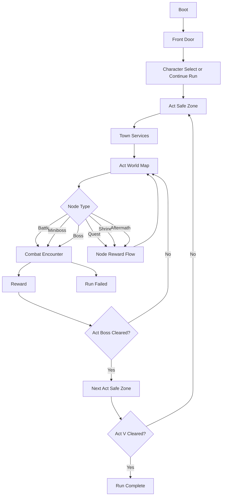

# Game Engine and Flow Plan

Documentation note:
- Start with `PROJECT_MASTER.md`.
- This document describes product-direction run-flow architecture.
- It is grounded in the live runtime, but it is not limited to what is already implemented.

## 1. Product Targets

- Build target: turn-based roguelite deckbuilder with high-fidelity Diablo II structure.
- Content spine: Acts I-V, canonical towns, canonical zones, canonical enemies and bosses, class build identity, and recognizable quest beats.
- Core readability rule: every state answers `who am I`, `what can I do`, and `what happens next`.
- Fidelity rule: preserve canonical D2 structure and names where feasible, but compress for run readability where needed.

## 2. Current Reality Versus Target

### Live now

- party combat between hero, mercenary, and encounter-sized enemy packs
- explicit phases: `boot`, `front_door`, `character_select`, `safe_zone`, `world_map`, `encounter`, `reward`, `act_transition`, `run_complete`, `run_failed`
- five-act route generation
- quest, shrine, and aftermath-event world nodes
- training-rank progression with banked skill points
- vendor, inventory, stash, and run-history persistence hooks
- three mercenary profiles

### Still target-state

- class skill trees wired from `skills.json`
- manual stat allocation beyond the current training model
- broader meta or profile progression
- broader mercenary pool and scaling rules
- broader event families and deeper quest chains
- asset-manifest-driven presentation and content lookups

## 3. Engine Architecture

### 3.1 Data-Driven Content Layer

Live runtime inputs:

- `data/seeds/d2/classes.json`
- `data/seeds/d2/zones.json`
- `data/seeds/d2/enemy-pools.json`
- `data/seeds/d2/monsters.json`
- `data/seeds/d2/items.json`
- `data/seeds/d2/runes.json`
- `data/seeds/d2/runewords.json`
- `data/seeds/d2/bosses.json`

Planned next runtime inputs:

- `data/seeds/d2/skills.json`
- `data/seeds/d2/assets-manifest.json`

Rules:

- runtime content should normalize these into immutable registries keyed by ID
- new content should be data-first whenever possible
- validation should fail loudly on bad references before the player reaches the shell

### 3.2 Runtime State Model

Live model:

- `AppState`: phase, loaded content, registries, UI state, active profile, active run, active combat
- `ProfileState`: active run snapshot, stash, run history
- `RunState`: class, mercenary, route state, inventory, loadout, economy, node outcomes, progression
- `CombatState`: turn order, intents, statuses, deck state, combat log
- `UIState`: selections, confirmations, and panel state

Planned next extension:

- expand `ProfileState` into a broader meta surface for unlocks, settings, tutorials, and long-run progression when the live data justifies it

### 3.3 Core Systems

- `ProgressionSystem`: builds act or zone routes, tracks completion, and owns class-growth mutation
- `EncounterSystem`: resolves `battle`, `miniboss`, `boss`, `quest`, `shrine`, `aftermath`, and future node families
- `CombatSystem`: deterministic turn resolver
- `RewardSystem`: battle or node rewards, boss floors, progression handoff, and town-economy handoff
- `CharacterSystem`: class baseline plus level growth plus future class-tree bonuses plus gear bonuses
- `SkillTreeSystem`: future validation and spend layer for class-family progression
- `PersistenceSystem`: run and profile save or load with schema versioning

### 3.4 Flow Coordinator

Use one explicit run phase enum:

- `boot`
- `front_door`
- `character_select`
- `safe_zone`
- `world_map`
- `encounter`
- `reward`
- `act_transition`
- `run_complete`
- `run_failed`

Reserved future addition:

- `meta_sync`

Hard rule: no UI action may mutate state outside the current phase contract.

## 4. Run Flow

## 5. Combat Flow

1. Start turn
- apply start-turn statuses
- refresh energy and draw

2. Player phase
- play cards
- use potions
- end turn

3. Mercenary action
- mercenary resolves deterministically

4. Enemy resolve phase
- execute visible intents in order

5. End turn
- death checks
- hand cleanup
- next-turn setup

## 6. Economy and Progression Rules

### 6.1 Live baseline

- each act owns a route of combat and non-combat nodes
- vendors are town-only
- node rewards resolve through the same run or reward seam
- leveling currently produces banked skill points and automatic training-rank growth
- town currently spends those points through `vitality`, `focus`, and `command` drills

### 6.2 Target progression direction

- class-family progression should sit on top of the current training scaffold rather than replacing the run loop
- `skills.json` should drive future class-tree unlocks and spend validation
- manual stat allocation should become explicit if it adds real build tension beyond the existing training system
- boss rewards should remain a major inflection point for class, gear, or economy growth

### 6.3 Economy direction

- vendor stock remains town-only
- inventory and stash stay outside combat
- item, rune, and runeword progression should become a real build axis rather than a thin support layer
- gold sinks should stay meaningful across heal, refill, mercenary, vendor, and future crafting flows

## 7. Mercenary System Contract

### Live now

- one mercenary slot per run
- hiring or replacing or reviving happens in safe zones
- current roster:
  - `rogue_scout`
  - `desert_guard`
  - `iron_wolf`
- current mercenary behavior is deterministic and tied to authored behavior packages

### Target next step

- broaden the roster
- deepen act or level scaling rules
- keep mercenary data in content rather than hardcoding class logic in the combat resolver

## 8. Onboarding Contract

This is still a target-state requirement, not a fully implemented system.

First-run onboarding should answer in under 30 seconds:

- `Who am I?`
- `Where am I starting?`
- `How do I leave town?`
- `Who is the enemy?`
- `What do I click first?`

Required clarity surfaces:

- persistent class or role labeling
- a safe-zone exit label that clearly points to the world map
- enemy target labeling in combat
- clear player-phase then enemy-phase explanation

## 9. Product-Manager Build Priorities

These are the next approved directions for implementation:

1. deepen front-door, town, and profile UX around the systems already live
2. wire class progression and `skills.json` into the runtime
3. add manual stat allocation only if it creates real build differentiation
4. broaden item or rune or mercenary breadth
5. broaden node families, quest chains, and encounter variety
6. keep all new content behind strong validation and deterministic runtime contracts
