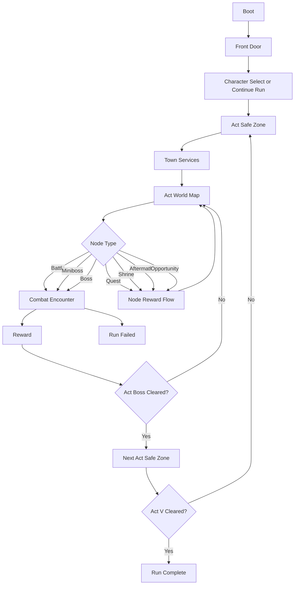

# Game Engine and Flow Plan

Documentation note:
- Start with `PROJECT_MASTER.md`.
- This document describes product-direction run-flow architecture.
- It is grounded in the live runtime, but it is not limited to what is already implemented.

## 1. Product Targets

- Build target: turn-based roguelite deckbuilder with high-fidelity dark-fantasy ARPG structure.
- Content spine: Acts I-V, Blood Rogue towns, Blood Rogue zones, Blood Rogue enemies and bosses, class build identity, and recognizable quest beats.
- Core readability rule: every state answers `who am I`, `what can I do`, and `what happens next`.
- Fidelity rule: preserve the genre's structural strengths while favoring Blood Rogue naming and readability whenever we choose between homage and direct copy.

## 2. Current Reality Versus Target

### Live now

- party combat between hero, mercenary, and encounter-sized enemy packs
- explicit phases: `boot`, `front_door`, `character_select`, `safe_zone`, `world_map`, `encounter`, `reward`, `act_transition`, `run_complete`, `run_failed`
- five-act route generation
- quest, shrine, event, and multiple opportunity world nodes with shrine-specific, crossroad, reserve-lane, relay-lane, culmination-lane, legacy-lane, reckoning-lane, recovery-lane, accord-lane, covenant-lane, detour-lane, escalation-lane, consequence-gated route payoffs, five-package consequence-conditioned branch-battle and branch-miniboss encounter and reward ladders, and a seven-package boss ladder
- `skills.json`-backed class trees plus manual class-point and attribute-point spending
- vendor, inventory, stash, unlock, tutorial, and run-history persistence hooks
- a navigable account hall, a hall decision desk, a hall-to-character-select-to-safe-zone expedition launch flow, town prep drilldowns, a town prep comparison board, a safe-zone before-or-after desk for the highest-value prep actions, route-intel map panels, a world-map route decision desk, a reward continuity desk, an act-transition delta wrapper, explicit reward or archive delta surfaces plus a run-end hall handoff across the active shell, and a shared charter or convergence drilldown layer on top of the account-meta continuity board
- seven mercenary contracts plus twelve-per-contract route-linked combat perks with crossroad-linked compound scaling plus reserve-linked, relay-linked, culmination-linked, legacy-linked, reckoning-linked, recovery-linked, accord-linked, and covenant-linked late payoffs, broader act encounter pools with six branch battles and six branch minibosses per act, a twenty-kind encounter-local modifier catalog, stronger escort, court-reserve, boss-salvo, backline-screen, boss-screen, sniper-nest, phalanx-march, linebreaker-charge, and ritual-cadence scripting, act-specific covenant boss retunes plus mobilized and posted aftermath boss courts, and four elite-affix families per act

### Still target-state

- broader class-tree depth and stronger class identity beyond the current live scaffold
- broader account-level unlock trees and profile UX beyond the current hall navigator, hall decision desk, expedition launch runway, prep-drilldown shell, before-or-after town-prep desk, route or reward or transition continuity shell, shared account-meta drilldown layer, and account ownership seam
- broader mercenary route-perk breadth tied to future route families beyond the current covenant-linked perk pass
- broader event families and deeper quest chains
- asset-manifest-driven presentation and content lookups

## 3. Engine Architecture

### 3.1 Data-Driven Content Layer

Live runtime inputs:

- `data/seeds/d2/classes.json`
- `data/seeds/d2/zones.json`
- `data/seeds/d2/enemy-pools.json`
- `data/seeds/d2/monsters.json`
- `data/seeds/d2/items.json`
- `data/seeds/d2/runes.json`
- `data/seeds/d2/runewords.json`
- `data/seeds/d2/bosses.json`

Planned next runtime inputs:

- `data/seeds/d2/assets-manifest.json`

Rules:

- runtime content should normalize these into immutable registries keyed by ID
- new content should be data-first whenever possible
- validation should fail loudly on bad references before the player reaches the shell

### 3.2 Runtime State Model

Live model:

- `AppState`: phase, loaded content, registries, UI state, active profile, active run, active combat
- `ProfileState`: active run snapshot, stash, run history, settings, unlocks, tutorials, and account-progression focus state
- `RunState`: class, mercenary, route state, inventory, loadout, economy, node outcomes, progression
- `CombatState`: turn order, intents, statuses, deck state, combat log
- `UIState`: selections, confirmations, and panel state

Planned next extension:

- grow shell-facing account UX and later-tier progression trees on top of the current profile seam without splitting the profile state too early

### 3.3 Core Systems

- `ProgressionSystem`: builds act or zone routes, tracks completion, and owns class-growth mutation
- `EncounterSystem`: resolves `battle`, `miniboss`, `boss`, `quest`, `shrine`, `aftermath`, `opportunity`, and future node families
- `CombatSystem`: deterministic turn resolver
- `RewardSystem`: battle or node rewards, boss floors, progression handoff, and town-economy handoff
- `CharacterSystem`: class baseline plus level growth plus future class-tree bonuses plus gear bonuses
- `SkillTreeSystem`: future validation and spend layer for class-family progression
- `PersistenceSystem`: run and profile save or load with schema versioning

### 3.4 Flow Coordinator

Use one explicit run phase enum:

- `boot`
- `front_door`
- `character_select`
- `safe_zone`
- `world_map`
- `encounter`
- `reward`
- `act_transition`
- `run_complete`
- `run_failed`

Reserved future addition:

- `meta_sync`

Hard rule: no UI action may mutate state outside the current phase contract.

## 4. Run Flow

## 5. Combat Flow

1. Start turn
- apply start-turn statuses
- refresh energy and draw

2. Player phase
- play cards
- use potions
- end turn

3. Mercenary action
- mercenary resolves deterministically

4. Enemy resolve phase
- execute visible intents in order

5. End turn
- death checks
- hand cleanup
- next-turn setup

### 5.1 Target combat tension rules

Target-state combat should preserve these rules even as counts and classes evolve:

- enemy intent stays visible before the player spends cards
- the opening turn should usually show more worthwhile actions than current energy allows
- the player should feel the cost of choosing offense, defense, setup, or tempo instead of trivially spending the whole hand
- extra opening generosity should come from draw texture, not simply from enough base energy to play everything
- bosses and minibosses are the primary tactical exams
- normal battles and most elites can stay more generous as long as they still create readable sequencing and target-priority decisions

## 6. Economy and Progression Rules

### 6.1 Live baseline

- each act owns a route of combat and non-combat nodes
- vendors are town-only
- node rewards resolve through the same run or reward seam
- leveling currently produces skill points, class points, attribute points, and automatic training-rank growth
- town currently spends those points through `vitality`, `focus`, and `command` drills plus manual class-point and attribute-point allocation
- archive or economy or mastery account trees already influence parts of archive retention, town economy, and reward behavior

### 6.2 Target progression direction

- class-family progression should sit on top of the current training scaffold rather than replacing the run loop
- `skills.json` already drives live class-tree unlocks and spend validation; the next step is broader class identity and later-tree depth
- manual stat allocation is already live; keep it only while it continues to create real build tension beyond the training system
- boss rewards and account-tree gates should remain major inflection points for class, gear, or economy growth

### 6.3 Economy direction

- vendor stock remains town-only
- inventory and stash stay outside combat
- item, rune, and runeword progression should become a real build axis rather than a thin support layer
- gold sinks should stay meaningful across heal, refill, mercenary, vendor, and future crafting flows

## 7. Mercenary System Contract

### Live now

- one mercenary slot per run
- hiring or replacing or reviving happens in safe zones
- current roster:
  - `rogue_scout`
  - `desert_guard`
  - `iron_wolf`
  - `kurast_shadow`
  - `templar_vanguard`
  - `harrogath_captain`
  - `pandemonium_scout`
- current mercenary behavior is deterministic and tied to authored behavior packages
- route-linked perk definitions can convert authored world flags into flat attack, behavior, opening Guard, hero Guard, hero damage, and opening-draw bonuses for the next combat

### Target next step

- deepen route-perk breadth only when new route families create a real later-run payoff seam beyond the current covenant-linked perk pass
- keep mercenary data in content rather than hardcoding class logic in the combat resolver

## 8. Onboarding Contract

This is still a target-state requirement, not a fully implemented system.

First-run onboarding should answer in under 30 seconds:

- `Who am I?`
- `Where am I starting?`
- `How do I leave town?`
- `Who is the enemy?`
- `What do I click first?`

Required clarity surfaces:

- persistent class or role labeling
- a safe-zone exit label that clearly points to the world map
- enemy target labeling in combat
- clear player-phase then enemy-phase explanation

## 9. Product-Manager Build Priorities

These are the next approved directions for implementation:

1. grow the account seam into broader capstone-style archive or economy or mastery systems plus richer archive or stash or economy read models on top of the current navigable hall
2. broaden route topology and non-combat node families beyond the current shrine-opportunity or crossroad or reserve or relay or culmination or legacy-or-reckoning-or-recovery-or-accord-into-covenant pattern plus detour-or-escalation follow-through
3. deepen late-act item or rune breadth, reward variety, and account-gated economy pressure
4. broaden modifier catalogs and escort scripting beyond the current twenty-modifier baseline, and only extend mercenary payoff where new route families justify it
5. continue shell expansion only where future account systems need dedicated unlock, stash, archive, or capstone review surfaces
6. keep all new content behind strong validation and deterministic runtime contracts while continuing architecture extraction on the biggest hotspots
