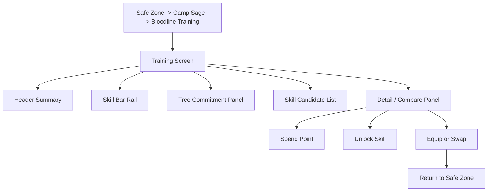

# Safe Zone Training Screen Spec

_Snapshot: 2026-04-04_

## Purpose

This document defines the target safe-zone training screen that should own:

- class-tree point spending
- skill-bar unlock visibility
- skill unlocks
- skill equip and swap decisions
- bridge-versus-capstone commitment clarity

It gives the skill-bar progression model a real UI home inside the current Rouge shell.

Use it with:

- [SKILL_TAXONOMY.md](/Users/andrew/proj/rouge/docs/SKILL_TAXONOMY.md)
- [CLASS_SKILL_BAR_BLUEPRINTS.md](/Users/andrew/proj/rouge/docs/CLASS_SKILL_BAR_BLUEPRINTS.md)
- [CLASS_STARTER_SKILL_BAR_SPECS.md](/Users/andrew/proj/rouge/docs/CLASS_STARTER_SKILL_BAR_SPECS.md)
- [CLASS_SLOT2_BRIDGE_SKILL_SPECS.md](/Users/andrew/proj/rouge/docs/CLASS_SLOT2_BRIDGE_SKILL_SPECS.md)
- [CLASS_SLOT3_CAPSTONE_SKILL_SPECS.md](/Users/andrew/proj/rouge/docs/CLASS_SLOT3_CAPSTONE_SKILL_SPECS.md)
- [SKILL_UNLOCK_AND_GATING_RULES.md](/Users/andrew/proj/rouge/docs/SKILL_UNLOCK_AND_GATING_RULES.md)
- [SAFE_ZONE_TRAINING_RUNTIME_MODEL.md](/Users/andrew/proj/rouge/docs/SAFE_ZONE_TRAINING_RUNTIME_MODEL.md)
- [SAFE_ZONE_TRAINING_TYPE_CHANGE_SPEC.md](/Users/andrew/proj/rouge/docs/SAFE_ZONE_TRAINING_TYPE_CHANGE_SPEC.md)
- [SAFE_ZONE_TRAINING_ACTION_DISPATCHER_CONTRACT.md](/Users/andrew/proj/rouge/docs/SAFE_ZONE_TRAINING_ACTION_DISPATCHER_CONTRACT.md)
- [SAFE_ZONE_TRAINING_IMPLEMENTATION_PLAN.md](/Users/andrew/proj/rouge/docs/SAFE_ZONE_TRAINING_IMPLEMENTATION_PLAN.md)
- [SKILLS_JSON_TRAINING_SCHEMA_PLAN.md](/Users/andrew/proj/rouge/docs/SKILLS_JSON_TRAINING_SCHEMA_PLAN.md)
- [CLASS_DECKBUILDER_PROGRESSION.md](/Users/andrew/proj/rouge/docs/CLASS_DECKBUILDER_PROGRESSION.md)
- [GAME_ENGINE_FLOW_PLAN.md](/Users/andrew/proj/rouge/docs/GAME_ENGINE_FLOW_PLAN.md)

This is target design, not a claim that the live runtime already supports the full screen.

## Current Reality

Live Rouge already has the right shell seam for this screen:

- safe zone is a real phase
- training already belongs to the camp sage
- the sage overlay already groups services under `Consult`, `Rites`, and `Bloodline Training`
- the safe-zone operations model already tracks:
  - `skillPointsAvailable`
  - `classPointsAvailable`
  - `attributePointsAvailable`
  - training ranks
  - unlocked class skills

So this screen should evolve the current `Bloodline Training` service.

It should not become a disconnected new system hidden elsewhere in the shell.

## Design Baseline From Benchmark Games

### Slay the Spire

Apply:

- early clarity
- one obvious starting identity
- low first-run rules burden

Result for Rouge:

- Act I training should be readable even when the player does not yet have `Slot 2`

### Monster Train

Apply:

- predictable power-step timing
- visible commitment milestones

Result for Rouge:

- `Slot 2` and `Slot 3` should look like known future beats, not surprise unlocks

### Across the Obelisk

Apply:

- party-role awareness
- support and answer tools presented as role decisions

Result for Rouge:

- bridge and capstone skills should explain how they help the hero, mercenary, or summons

### Wildfrost

Apply:

- compact tactical language
- easy-to-scan keyword surfaces

Result for Rouge:

- skill cards and slot states should be compact and legible, not giant paragraphs hidden in a tree

### Vault of the Void

Apply:

- loadout decisions between fights
- deliberate swap points

Result for Rouge:

- skill equip and swap happens only in the safe zone or act transition training surface

## Screen Goal

The player should be able to answer these questions in one visit:

- what skill bar am I using right now
- what will unlock next
- which tree am I actually committing to
- what skill should I equip in `Slot 2` or `Slot 3`
- what am I giving up if I swap

If the player leaves the screen and still does not know whether the run is primary-tree committed, the screen failed.

## Screen Placement

### Entry Point

Primary entry:

- safe zone
- click sage NPC
- choose `Bloodline Training`

Secondary entry:

- act transition review
- choose `Training`

Do not add:

- map-screen access
- reward-screen access
- in-combat access

## Screen Contract

The training screen should unify three things that currently feel separate:

1. class-tree investment
2. skill-bar progression
3. skill equip decisions

It should not unify everything progression-related.

Keep these outside the screen:

- card deck changes
- blacksmith evolutions
- stash and item planning
- mercenary hiring
- route selection

Those already have other homes.

## Information Hierarchy

The screen should read top-to-bottom like this:

1. current build summary
2. current skill bar
3. class-tree commitment state
4. unlock candidates
5. detailed comparison and action buttons

That order matters.

The player should see the bar first, not a giant tree first.

## Recommended Layout

### 1. Header Summary

Show:

- class name and level
- current favored tree
- `skill`, `class`, and `attribute` points available
- current slot state:
  - `1 / 3`
  - `2 / 3`
  - `3 / 3`
- next slot gate summary

Example copy:

- `Slot 2 opens at Level 6 and 3 points in any tree.`
- `Slot 3 opens at Level 12 with 6 points in a favored tree and one bridge skill from that tree.`

### 2. Skill Bar Rail

Show three persistent slot cards:

- `Slot 1`
- `Slot 2`
- `Slot 3`

Each slot card should show:

- slot role label:
  - `Identity`
  - `Tactical`
  - `Commitment`
- equipped skill name if filled
- family
- cost
- cooldown
- short rule text
- state badge:
  - `Equipped`
  - `Locked`
  - `Available`
  - `Eligible to Equip`

Locked slots should still show the gate.

Do not hide future slots entirely.

### 3. Tree Commitment Panel

Show the three class trees side by side or as a vertical selector with clear commitment readouts.

Per tree, show:

- points invested
- whether the tree currently unlocks a bridge pool
- whether the tree currently qualifies as favored
- whether it currently qualifies for capstone access
- next milestone

Use plain language badges:

- `Bridge Ready`
- `Bridge Locked`
- `Favored Tree`
- `Capstone Ready`
- `Needs 2 More Points`
- `Tie Broken By 2+ Needed`

Do not force the player to mentally parse raw prerequisite graphs.

## Candidate List Rules

The candidate list should be filtered by the selected tree and grouped by tier.

Groups:

- `Starter`
- `Bridge`
- `Capstone`

For the first implementation:

- `Starter` is view-only
- `Bridge` can be unlocked or equipped once `Slot 2` is live
- `Capstone` can be unlocked or equipped once `Slot 3` is live and favored-tree rules are met

Each skill row should show:

- skill name
- family
- slot target
- cost
- cooldown
- exact text
- status:
  - `Starter`
  - `Locked`
  - `Unlocked`
  - `Equipped`
  - `Can Equip`
- gate explanation when locked

## Detail And Compare Panel

Selecting a skill should open a detail panel that answers:

- what it does
- why it fits this tree
- what slot it belongs to
- what current equipped skill it would replace
- what role shift it creates in the build

This panel should show:

- exact text
- family
- slot
- gate state
- short `Why This Exists` note
- short `Compared To Equipped Skill` note if applicable

Example compare copy:

- `Swapping from Evasive Step to Hunter's Focus gives up one defensive answer and adds a single-target payoff engine with mercenary coordination.`

## Actions

The training screen should support a small number of explicit actions.

### Spend Tree Point

Use:

- spend `class points`
- advance tree investment
- potentially unlock a bridge or capstone gate

Immediate feedback:

- update favored tree state
- update next slot gate state
- update candidate availability

### Unlock Skill

Use:

- convert an eligible skill from `Locked` to `Unlocked`

Important:

- unlocking should not auto-equip by default
- auto-equip should only be offered when a slot is empty

### Equip Skill

Use:

- equip an unlocked skill into its valid slot

Rules:

- bridge skills equip into `Slot 2`
- capstones equip into `Slot 3`
- starter remains in `Slot 1` in the first implementation

### Swap Skill

Use:

- replace the current skill in `Slot 2` or `Slot 3`

Rules:

- swapping is free in the first implementation
- swapping is only allowed on this screen or at act transition training

### Review Gate

Use:

- inspect why a skill is still locked

This should be a first-class interaction, not a tiny disabled tooltip.

## State Model

The screen should represent skill state with a small, explicit vocabulary:

- `starter`
- `locked_by_level`
- `locked_by_tree_points`
- `locked_by_favored_tree`
- `locked_by_slot`
- `unlocked`
- `equipped`

This matters because the player needs to know whether they are blocked by:

- campaign timing
- tree commitment
- slot timing
- a loadout choice

Those are different problems and should not be flattened into one generic `Locked`.

## Copy Rules

The training screen should speak in plain language first.

Good:

- `Slot 3 is locked: reach Level 12, invest 6 points in a favored tree, and unlock one bridge skill from that tree.`
- `This tree is not favored yet. Put 2 more points here or reduce the tie.`
- `Bridge Ready: you can now unlock one Slot 2 skill from this tree.`

Bad:

- `Prerequisite graph unmet.`
- `Tree threshold invalid.`
- `Slot access denied.`

## First-Run And Low-Complexity Behavior

Act I should remain simple.

When `Slot 2` is still locked:

- emphasize the current starter skill
- show only the next bridge milestone
- do not flood the screen with all capstones at equal visual weight

Recommended presentation:

- highlight one `Next Recommended Unlock` candidate per tree
- collapse capstone details behind a clear `Later` section until `Slot 3` is realistically near

## Act-Transition Behavior

The act-transition version of this screen should be lighter than the safe-zone version.

At act transition:

- reuse the same slot rail
- show newly opened gates prominently
- show one recommended equip decision
- allow swap and equip
- avoid full merchant-desk verbosity

Think:

- same rules
- lighter wrapper

## Visual Priorities

The visual hierarchy should support the strategy model.

Highest emphasis:

- equipped skill bar
- favored tree
- newly available bridge or capstone

Medium emphasis:

- alternative unlocks in the same tree
- utility splash bridges in secondary trees

Lower emphasis:

- skills that are many levels away

## Safe-Zone Integration

This screen should sit inside the existing sage service stack.

Recommended safe-zone wording:

- `Consult`: understand tree paths and upcoming gates
- `Rites`: purge or transmute deck problems
- `Bloodline Training`: spend points, unlock skills, and configure the skill bar

That keeps the live safe-zone structure intact while giving `Bloodline Training` a clearer purpose.

## Implementation Guidance

The first implementation can stay narrower than the full target spec.

Start with:

- `Slot 1` visible and fixed
- `Slot 2` and `Slot 3` visible with gate text
- one tree selector
- one candidate list
- one detail panel
- unlock and equip flows

Do not block the first implementation on:

- animated tree graphs
- complex refund flows
- account-wide starter variants
- rich voiceover or tutorial scripting

The important part is structural clarity.

## Success Criteria

The screen is doing its job if:

- a player can tell which tree is primary without reading raw point totals carefully
- a player can tell why `Slot 2` or `Slot 3` is locked
- a player can compare two bridge skills without outside documentation
- a player can identify what their bar is trying to do this act
- a player can make a skill equip decision in one visit

The screen is failing if:

- it feels like a separate metagame
- it hides the current equipped bar behind tree navigation
- it makes skill loadout decisions harder than card reward decisions
- it encourages constant slot micromanagement at every town stop

## Next Use

Use this doc to draft:

1. the training-screen state model and actions in runtime terms
2. the safe-zone and act-transition UI component plan
3. the first playable implementation scope for skill unlock and equip flow
